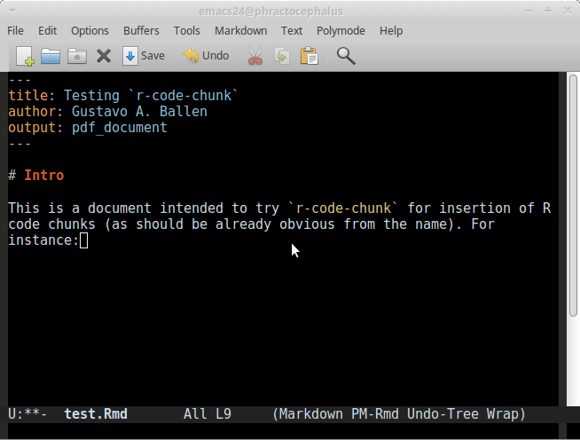

# rmarkdown-goodies

Repo for the `rmarkdown-goodies` emacs package, intended to complement `markdown-mode` for `R` markdown.

Although `markdown-mode` is full-featured, it seems to lack a keystroke for inserting specifically an `R` code chunk; the latter is a quite specific need and therefore there wouldn't be any reason to blame such an amazing package for lacking the feature beside that an R coder would miss such functionality already availabe in RStudio. It is worthy to mention that the combination of `markdown-mode`, `ESS`, and `polymode` make Emacs a perfect platform for writing Rmarkdown, markdown, and for interactive work.

This small need made a perfect opportunity to learn a bit more elisp for implementing a function that inserts an `R` code chunk centering the cursor inbetween the backtick sets so that the user can start writing `R` code directly into the chunk (animation 'giffed' using [`peek`](https://github.com/phw/peek)):



This approach includes special-case functions for specific needs when authoring documents intended to hide the code or not evaluate `R` code at compilation.

This package also contains a function for compilation of Rmd files without need for an interactive `R` session and buffer switching.

# Dependencies

This package depends on `markdown-mode`, `ESS`, and `polymode` as already mentioned. I suggest to install them through Melpa.

# Installation

This package is expected to be available through Melpa sometime in the future (currently preparing submission). From Emacs, just type:

```{elisp}
; M-x package-list-packages ;; not yet
```

and then look for `rmarkdown-goodies`. 

Alternatively (actually, the current only method available), you can justs clone this repo and modify your `.emacs` file (or its relevant replacement file):

```{lisp}
; load the r-code-chunk code
(load "path/to/this/repo/rmarkdown-goodies/rmarkdown-goodies.el")
```

# Notes

The keystrokes now are implemented with local-key-set so they are available only for markdown buffers. If you find this package interacting with other Emacs functions because of its keystrokes, you can modify it in the lines under the `;; Keybinding` section at the end of the `rmarkdown-goodies.el` file. Please note that [Emacs Key Binding Conventions](https://www.gnu.org/software/emacs/manual/html_node/elisp/Key-Binding-Conventions.html) were followed, so you are also encouraged to keep them in mind if modifying any combination.

Now the compiler function passes messages to the minibuffer indicating that compilation is taking place, and then when it's done.

# Usage

- Insert an `R` code chunk with `C-c C-c C-c` (or its alternative if you modify the key combination as indicated above).
- Insert a text-only `R` code chunk with `C-c C-c C-t`. This generates an `R` code chunk with the `eval = FALSE` argument
- Insert a silent `R` code chunk with `C-c C-c C-s`. This generates an `R` code chunk with the `echo = FALSE` argument
- Compilation of the current buffer works with `C-c C-c C-o`
